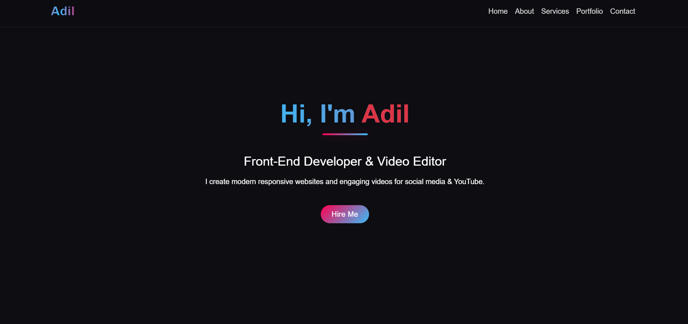
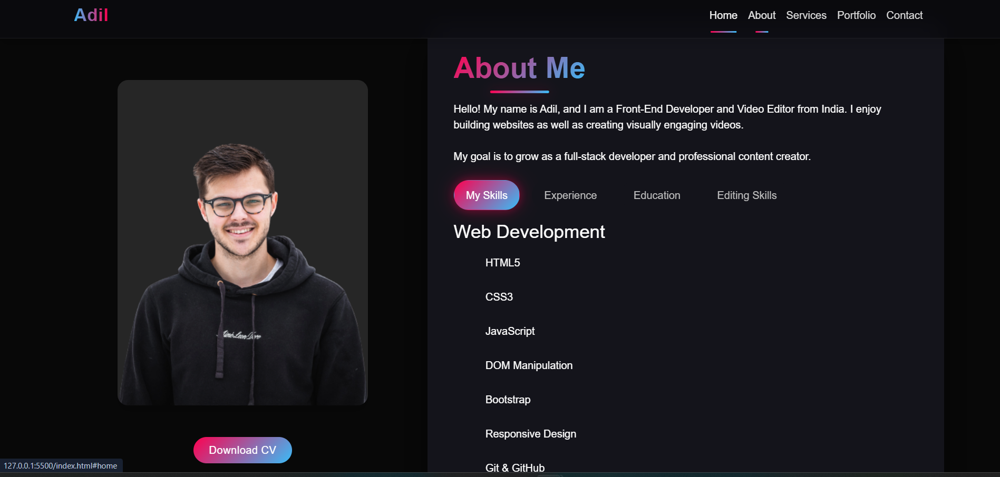
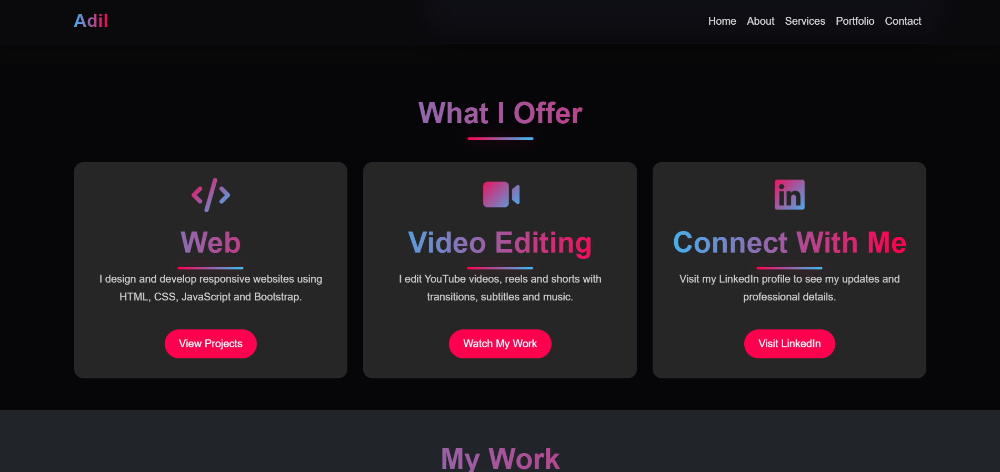
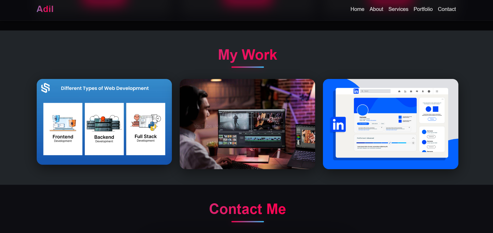
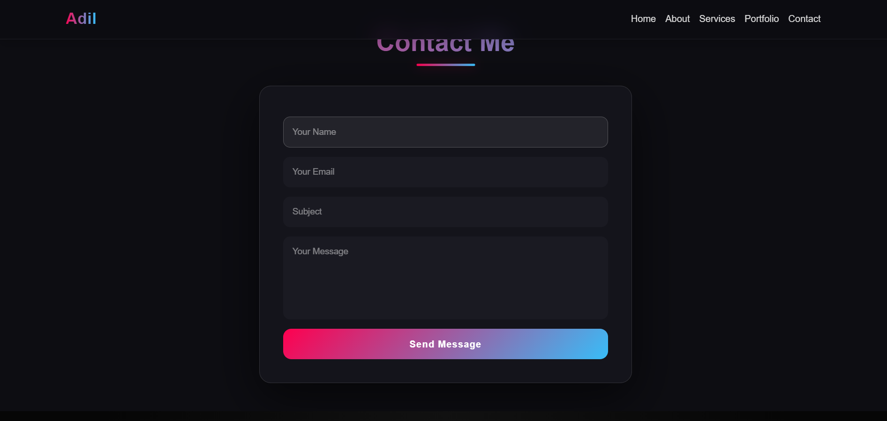
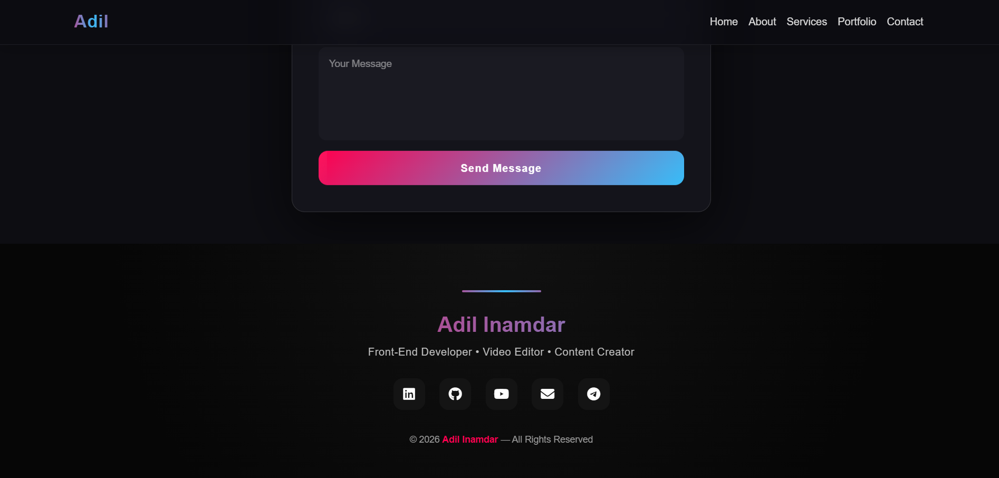

# 🌐 Personal Portfolio Website

This is my **Personal Portfolio Website** project built to showcase my skills, services, and projects as a frontend developer.
The website presents information about me, the technologies I work with, and ways to contact me.

---

## 🚀 Live Website

👉 https://adilinamdar617-creator.github.io/frontend-projects/

---

## 📌 About The Project

The purpose of this project is to create a modern and responsive portfolio where visitors can:

* Know about me
* View my skills
* See the services I provide
* Explore my projects
* Contact me directly

This project helped me practice real-world frontend development concepts such as responsive layouts, navigation systems, and form handling.

---

## 🛠️ Built With

* HTML5
* CSS3
* Bootstrap 5
* JavaScript
* Font Awesome Icons
* Formspree (for contact form)

---

## ✨ Features

* Responsive design (works on mobile, tablet, desktop)
* Sticky navigation bar
* Hamburger menu for small screens
* Smooth scrolling
* About section with profile image
* Services cards (Web Development & Video Editing)
* Portfolio project cards
* Contact form
* Social media links
* External links open in new tab

---

## 📸 Screenshots

### Home



### About



### Services



### Portfolio



### Contact



### Footer



---

## 📂 Project Structure

```
portfolio/
│── index.html
│── style.css
│── script.js
│── /images
```

---

## ⚙️ How to Run Locally

1. Go to the repository
2. Open the **portfolio** folder
3. Double click `index.html`

Or:

```
git clone https://github.com/adilinamdar617-creator/frontend-projects.git
cd frontend-projects/portfolio
```

Then open **index.html** in your browser.

---

## 📬 Contact

* GitHub: https://github.com/adilinamdar617-creator
* LinkedIn: https://www.linkedin.com/in/adil-inamdar/
* Email: [adilinamdar617@gmail.com](mailto:adilinamdar617@gmail.com)

---

## 🎯 What I Learned

* Responsive web design
* Bootstrap components
* Navigation menu toggle
* Handling external links
* Contact form integration
* Project structuring

---

## 📜 License

This project is created for learning purposes and personal use.
